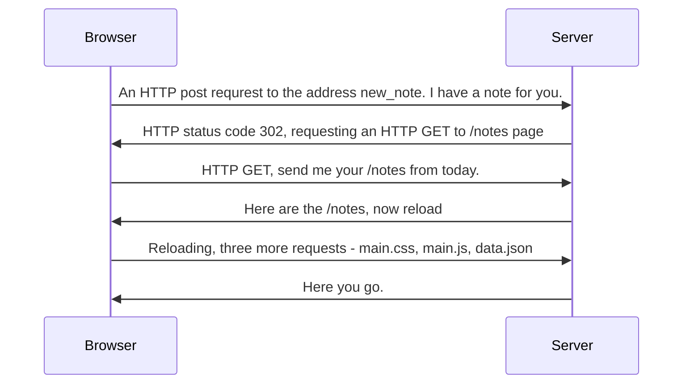

```mermaid
sequenceDiagram
    Browser->>Server: An HTTP post requrest to the address new_note. I have a note for you.
    Server->>Browser: HTTP status code 302, requesting an HTTP GET to /notes page
    Browser->>Server: HTTP GET, send me your /notes from today.
    Server->>Browser: Here are the /notes, now reload
    Browser->>Server: Reloading, three more requests - main.css, main.js, data.json
    Server->>Browser: Here you go.
```